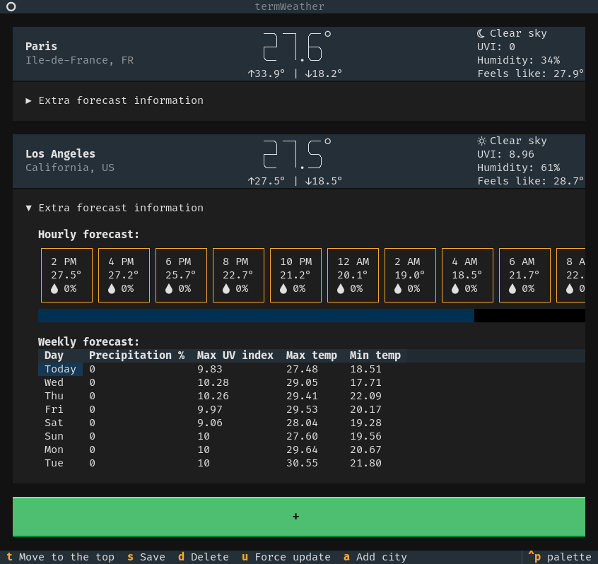

# termWeather

A simple terminal weather application built with Python and [Textual](https://github.com/textualize/textual/).



termWeather provides current weather conditions, hourly forecasts, and weekly forecasts for multiple cities using the OpenWeatherMap API.

## Features
- **Current weather**: Search weather forecasts by city
- **Hourly and weekl forecast**: Weather predictions with precipitation probability and more
- **Persistent storage**: Save your favorite cities to configuration file
- **Auto refresh**: Weather data updates automatically every 10 minutes
- **Interactive TUI**: Terminal user interface with keyboard shortcuts

## Prerequisites
- Python 3.8+
- [OpenWeatherMap API](https://openweathermap.org/api) key (free tier works)
- A [Nerd Font](https://www.nerdfonts.com/) (for icons)

## Installation
1. Clone this repository:
2. Install requirements
    ```bash
    pip install -r requirements.txt
    ```
3. Copy `.env.example` to `.env` and set your API key

## Installation
1. Clone the repository:
```bash
git clone https://github.com/Quak1/termWeather
cd termWeather
```

2. Install required dependencies:
```bash
pip install -r requirements
```

3. [Get your OpenWeatherMap API key](https://openweathermap.org/api/one-call-3#start)

4. Copy `.env.example` to `.env` and set you API key

## Usage

### Running the application

1. Make sure `main.sh` is executable:
```bash
chmod +x ./main.sh
```

2. Start the application
```bash
./main.sh
```

- Alternatively you can run python directly:
```bash
python3 ./src/main.py
```

### Keyboard Shortcuts

| Key | Action |
|-----|--------|
| `a` | Add a new city |
| `t` | Move focused card to top |
| `s` | Save city to configuration |
| `d` | Delete weather card |
| `u` | Force update weather data |
| `ctrl+p` | Open the default command pallete |
| `ctrl+q` | Quit the application |

## Configuration

The app uses a configuration file (`src/config.ini`) to store settings and saved cities:

### Customizable Settings

- **units**: set to one of
    - `metric` (Celsius)
    - `imperial` (Fahrenheit)
    - `standard` (Kelvin)
- **update_time_s**: auto-refresh interval in seconds (default: 600 = 10 minutes). OpenWeatherMap API data is updated every 10 minutes, 600 seconds makes sure you have the most up-to-date data.
- **delete a saved city**: Remove the desired `CITY - ...` section from the configuration file.
